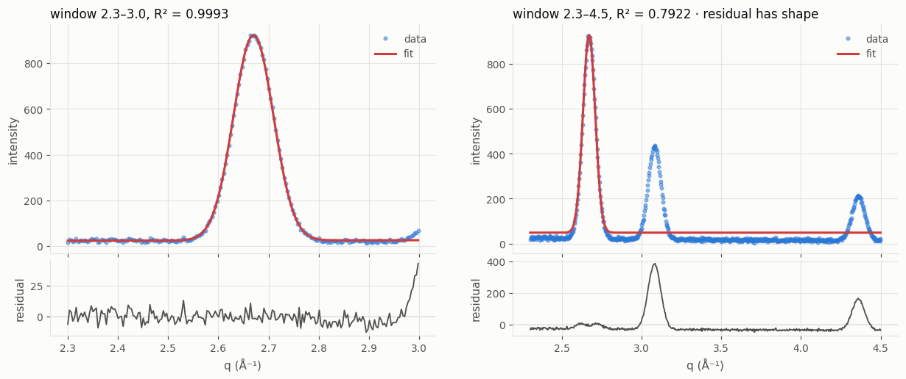
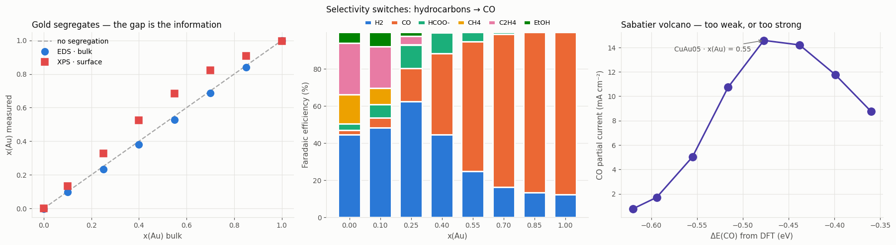

# NanoOrganizer

Organise experimental metadata, visualise any measurement, analyse in batch,
and compare across samples.

A laboratory accumulates data faster than it accumulates structure: a folder of
spectra here, a drive of micrographs there, and the conditions that produced
them in a notebook or a script. NanoOrganizer gives that material one
sample-centric model, so a question like *does the band shift with synthesis
temperature?* is a filter and a plot rather than an afternoon.

**The loop is the point: filter → analyse → new columns → filter again.**

This page walks the whole loop on generated data, in the order the three
workflow notebooks do — [`10_simulate_data`](notebook/10_simulate_data.ipynb)
→ [`11_build_organizer`](notebook/11_build_organizer.ipynb) →
[`12_use_organizer`](notebook/12_use_organizer.ipynb) — using only the
package's own functions, so every line below is something you would type on
your own data.

## Install

```bash
pip install -e ".[web,image]"
```

Dependencies are numpy, scipy, matplotlib and pandas; Pillow and scikit-image
for micrographs; Streamlit and Plotly for the GUI. Nothing else.

## Run the GUI

```bash
streamlit run NanoOrganizer/web_app/Home.py   # local, no login → http://localhost:8501
viz                                           # password + folder fence, port 8800
viz 8900                                      # the same, on another port
```

`streamlit run` is the plain local app. `viz` is the console command the
package installs: it asks for an access password, binds to every interface so
colleagues can reach it by hostname, and only lets the file pickers see the
folder you started it in, your home directory, and any extra roots you
configure — the mode for a shared machine.

**First thing to click: 🎓 Demo.** Six tabs — *Simulate, Build, Look,
Visualize, Analyze, Compare* — do everything in the walkthrough below with
buttons, and show the Python each button runs. When it is built, the organizer
opens in the workflow pages (**Project → Structure → Explore & Filter →
Visualize → Analyze → Compare**), which drive the very same object a notebook
does, so the two cannot drift apart.
[`docs/gui_demo.md`](docs/gui_demo.md) is the guided tour, with screenshots;
[`docs/web_app.md`](docs/web_app.md) describes every page.

---

## Walkthrough: from scattered files to a compared campaign

### 0 · Get some data

```bash
python -m NanoOrganizer.demo --lab      # writes ~/Repos/OrgDemo/Lab
```

(or run notebook `10_simulate_data`, or **Demo → 1 Simulate** in the GUI —
all three call the same generator.) Generated data goes under one parent,
`~/Repos/OrgDemo` by default; set `$NANOORGANIZER_DEMO_ROOT` to move it.

What you get is a rig writing files the way rigs do — **three instruments,
three folder trees, three naming conventions, none of them agreeing**:

```
📁 RawData  3 folders
├── 📁 microscope_share  6 folders
│   ├── 📁 S01  4 files · .tif 3, .txt 1         a folder per sample
│   └── …
├── 📁 spectrometer  1 folder
│   └── 📁 2026-03-11  84 files · .csv 84       S01_t0090s.csv — one per frame
└── 📁 xrd_rig  6 files · .dat 6                S01_waxs.dat — one per sample
```

plus `Meta/synthesis_dict.json`, what the operator wrote down — the synthesis
conditions and **the spectra only**. The micrographs and the diffraction came
from other people on other days and nobody recorded them. That is the normal
state of affairs, and it is why the next step links them by hand.

One number is hidden on purpose: **the synthesis temperature** sets the
particle size, which sets the plasmon band, the diffraction line width and what
the micrographs show. `Meta/truth.csv` is the answer key, so step E can check
what the pipeline recovers — the one thing real data never lets you do.

*(The listing above is `structure.tree(LAB / "RawData", depth=2)` — the same
walk works on any folder, JSON record, HDF5 group or `.npz`, reading shapes
from headers rather than loading data.)*

### 1 · Build the organizer — notebook 11

An **organizer is one JSON file you name**. Not a directory layout and not a
hidden folder — a document you can copy, diff, version and email. It records
*where* things are; the data never moves.

```python
import json
from NanoOrganizer import Organizer
from NanoOrganizer.demo import demo_root

LAB = demo_root("Lab")                       # ~/Repos/OrgDemo/Lab
RAW = LAB / "RawData"

org = Organizer(LAB / "lab.json", name="lab demo")      # empty if the file is new

synthesis = json.loads((LAB / "Meta" / "synthesis_dict.json").read_text())
org.ingest(synthesis=synthesis)              # the dict itself; the keyword names the stage
org.table()[["synthesis.conditions.temperature_C", "modalities"]]
```

`ingest` takes **the dict, not a path to it** — what a notebook actually has.
Any block of a record that names files becomes a measurement (here, the
spectrum glob); everything else is kept as a parameter and flattens into a
dotted, filterable column.

The dict stays live. Edit it and ingest again; `replace=True` makes it the
whole truth for its stage, so a popped key is really gone rather than lingering
as a merge artefact:

```python
# A seventh synthesis that failed: conditions and no data at all. Recording it
# matters — leaving it out biases every later comparison.
synthesis["S07"] = {"sample_id": "S07",
                    "synthesis_batch": {"status": "error",
                                        "error": "precursor precipitated"},
                    "conditions": {"temperature_C": 120.0}}
org.ingest(synthesis=synthesis, replace=True)
```

Then **link what nobody wrote down** — one call per measurement, by hand,
because that is the only thing that is true:

```python
for sample in org.ids():
    scope = RAW / "microscope_share" / sample          # a folder per sample
    waxs = RAW / "xrd_rig" / f"{sample}_waxs.dat"      # one file per sample
    if scope.is_dir():
        org.link(sample, "tem", str(scope), stage="characterization",
                 nm_per_pixel=0.5)
    if waxs.exists():
        org.link(sample, "waxs1d", str(waxs), stage="characterization")
```

`link` reads its third argument three ways:

| | |
|---|---|
| a **folder** | listed now, filtered by the technique's extensions — a snapshot you can audit (`session.txt` beside the TIFFs is left out without being asked) |
| a **glob** | kept live, re-expanded on every read, so frames written later appear |
| a **path or list** | stored verbatim |

Paths are recorded exactly as given — a rewritten store only works on the
machine that wrote it. Each link instead registers the **mount** its data sits
on as an alias, so moving to another machine is one line per mount, not one
edit per record.

```python
org.set_params("S01", stage="synthesis", batch_group="morning")  # anything else worth filtering on
org.catalog()               # the sample × technique matrix — S07 is the empty row
org.save()                  # one file: links, parameters, aliases
org.links_table().head()    # every link as a table; link_table(csv) reads it back
```

The catalog's gaps are the point: a measurement matrix is always sparse, and
seeing which comparisons exist beats finding out halfway through an argument.
`links_table()` round-trips through `link_table()` unchanged, because a
spreadsheet is a better editor than a form when forty rows need the same fix.

`attach_folders()` also exists, for data genuinely laid out as
`<Modality>Data/<SampleID>/` under one root. It is the exception, not the
route this page leads with, because almost no campaign is shaped that way.

### 2 · Use it — notebook 12

Six parts, in the order a session actually goes. The through-line is that
**nothing is a dead end**: you always get the arrays, so the moment an analysis
stops fitting what a convenience call assumed, you carry on with your own code.

**A · Look at it.** Reopening is the same call, and everything is back.

```python
org = Organizer(LAB / "lab.json")
org.describe()                               # samples, stages, techniques, what is readable here
print(org.tree(depth=2, limit=5))            # the file's structure — of the live session, not the last save
org.catalog()

org.ids("`synthesis.conditions.temperature_C` >= 90")   # a question, without committing to it
hot = org.subset(query="`synthesis.conditions.temperature_C` >= 90", name="hot")
```

A subset is a **deep copy**, not a view, so analysing it cannot write derived
values back into the parent by accident. Nothing is written until you `save()`
it. `org.filter(...)` instead makes the selection current for every later call
(`org.clear()` drops it).

**B · Load data** — all of it, or one frame at a time.

```python
x, Y, info = org.data("S01", "uvvis")         # Y is (14 frames, 401 points); info["t_s"] from the filenames
_, Y600, _ = org.data("S01", "uvvis", t=600)  # the frame nearest 600 s
org.frames("S01", "uvvis").head()             # one row per file: what each name admitted about time/temperature

frames = org.data("S01", "tem", lazy=True)    # resolved, nothing read
len(frames), frames.names                     # known before any file is opened
image, meta = frames[1]                       # one file opened; meta["nm_per_pixel"] from the TIFF
q, W, _ = org.data("S01", "waxs1d")
```

`lazy=True` is the difference between looking at the third of four hundred
micrographs and reading twelve gigabytes to do it; a single file holding a
volume is memory-mapped, so its frames are planes.

**C · Visualise** — the arrays from B, into a figure you made. Every plot
function takes `ax=`, draws there, and returns what it drew on:

```python
import matplotlib.pyplot as plt
from NanoOrganizer.viz.plots import plot_curves, plot_image, plot_series

curves = []
for sample in ["S01", "S03", "S06"]:
    q_s, W_s, _ = org.data(sample, "waxs1d")
    curves.append((sample, q_s, W_s[0]))

height, width = image.shape
scale = meta["nm_per_pixel"]

fig, axes = plt.subplots(1, 3, figsize=(16.5, 4.4))
plot_series(x, Y, info["t_s"], ax=axes[0], xlabel="wavelength (nm)",
            ylabel="absorbance", colorbar_label="time (s)")
plot_curves(curves, ax=axes[1], xlabel="q (Å⁻¹)", ylabel="intensity",
            xlim=(2.3, 3.3))
plot_image(image, ax=axes[2], cmap="gray",
           extent=(0, width * scale, height * scale, 0), xlabel="nm", ylabel="nm")
fig.tight_layout()
```


A growth series is coloured along **one hue by time**, with a colour bar
instead of a legend of fourteen timestamps; the micrograph is on nanometre
axes because the TIFF carried its calibration, so a distance read off it means
something. Each panel is one call, and the figure is yours to annotate after.

**D · Fit one, look at it, *then* batch.** The fit is a function of two arrays
— no files, no project — and drawing it is a second, separate call:

```python
from NanoOrganizer.analysis import fit_peaks
from NanoOrganizer.viz.plots import plot_fit

fit = fit_peaks(q, W[0], n_peaks=1, x_range=(2.3, 3.0), background="linear")
fit                          # <PeakFitResult 1 peak(s) at [2.67], R² = 0.9993>
fit.params, fit.errors       # centre, width, amplitude, background — and their 1σ

fig, ax = plt.subplots(figsize=(7, 5))
plot_fit(fit.x, fit.y, fit.y_fit, fit.residual, ax=ax, xlabel="q (Å⁻¹)",
         title=f"S01, R² = {fit.r2:.4f}")    # residuals split off the bottom of ax

for window in [(2.3, 3.0), (2.3, 3.6), (2.3, 4.5)]:
    trial = fit_peaks(q, W[0], n_peaks=1, x_range=window, background="linear")
    print(window, f"centre {trial.params['peak1_center']:.4f}  R² {trial.r2:.4f}")
```



The residual panel is where a bad fit shows: a fitted line over data is
persuasive whatever it does, and residuals that stop being noise and start
having shape are the thing to look at. Settling the parameters on one sample
you can *see*, and only then spending them on the whole set, is the same work
as batching first and reading the R² column afterwards — in the order that
does not hide the mistake:

```python
params = dict(x_range=(2.3, 3.0), n_peaks=1, background="linear")
org.batch("peak_fit", modality="waxs1d", link=True, **params)
org.batch("peak_fit", modality="uvvis", link=True,
          x_range=(450, 700), n_peaks=1, background="linear")
org.results()[["sample_id", "modality", "ok", "fit_r2"]]
org.save()
```

A batch writes each result's scalars back as columns — `derived.waxs1d_peak1_center`,
`derived.uvvis_peak1_center`, prefixed by technique so two fits cannot
overwrite each other — and reports its failures rather than skipping them.
`link=True` also writes the fitted *curves* beside the organizer and links
them onto their sample, which is what part F reads back.

**E · Compare: ids → table → plot.** Each step is a thing you can look at:

```python
import numpy as np
import pandas as pd
from NanoOrganizer.viz.plots import plot_compare

ids = org.ids("`synthesis.status` == 'done'")          # S07 failed
table = org.table(sample_ids=ids)
truth = pd.read_csv(LAB / "Meta" / "truth.csv").set_index("sample_id")

check = pd.DataFrame({
    "fitted_band_nm": table["derived.uvvis_peak1_center"],
    "waxs_fwhm_invA": table["derived.waxs1d_peak1_width"] * 2.3548,  # σ → FWHM
}).join(truth).reset_index()
check["inverse_d"] = 1.0 / check["true_diameter_nm"]
slope, intercept = np.polyfit(check["inverse_d"], check["waxs_fwhm_invA"], 1)

fig, axes = plt.subplots(1, 3, figsize=(16.5, 4.6))
plot_compare(check, "true_band_nm", "fitted_band_nm", ax=axes[0])
axes[0].axline((520, 520), slope=1, linestyle="--", color="0.6")      # parity
plot_compare(check, "inverse_d", "waxs_fwhm_invA", ax=axes[1])
axes[1].axline((0, intercept), slope=slope, linestyle="--", color="0.6")
plot_compare(org.table(), "synthesis.conditions.temperature_C",
             "derived.uvvis_peak1_center", ax=axes[2])
fig.tight_layout()
```


Two techniques that never met recover the same hidden number from opposite
directions: the plasmon band lands within **1.3 nm** of the generator's, and
the diffraction line width is Scherrer — a straight line in 1/D through the
origin, slope **0.561** against **0.565** expected. The last panel is the plot
the whole pipeline exists to produce, read straight off the table.

**F · Reopen, and go round again.** Nothing is refitted: the stored curves come
off disk.

```python
from NanoOrganizer.viz.plots import plot_peak_fit

later = Organizer(LAB / "lab.json")
later.results()                                              # what has been analysed, and how
result = later.result("S03", "peak_fit", modality="waxs1d")  # read back, not recomputed

fig, ax = plt.subplots(figsize=(7, 5))
plot_peak_fit(result, ax=ax)                                 # the fit over its data, residuals beneath
```

A fit is a measurement of a measurement, so it needs no second mechanism: it
sits on its sample as modality `fit`, shows in `catalog()`, and survives the
organizer being reopened months later on another machine. `modality=` picks
between two fits of one sample — the UV-Vis band and the diffraction peak are
two results, not one.

> Every step above also has a one-call shortcut on the organizer — draw a
> measurement by sample and technique, overlay a technique across samples,
> fit one sample, redraw a stored fit. Notebook 12 shows them; this page uses
> the calls underneath, because those are the ones you keep when an analysis
> stops fitting what a shortcut assumed.

**It scales.** Keying on `sample_id` is not a small-campaign idea: **10 000
samples** ingest in 0.15 s, save in 0.9 s (13 MB), load in 0.4 s and filter in
0.1 s on an ordinary laptop. A plate-based campaign uses the same calls as this
six-sample one.

---

## Analysis and plotting are separate calls

Two rules hold for every function in the package, and they are what made the
walkthrough above possible:

1. **Kernel and adapter.** Every analysis and every plot is written twice: a
   *kernel* that takes plain arrays (`fit_peaks(x, y)`, `plot_fit(x, y,
   y_fit)`) and a thin *adapter* that finds the data, calls the kernel and
   files the answer (`peak_fit(measurement, resolver)`, `plot_peak_fit(result)`).
   The numerical half is always callable on two arrays you made up.
2. **A plot draws; it never analyses.** Every plot function takes `ax=None`,
   draws only there when given one, and returns what it drew on — so it drops
   into anyone's grid. No function both computes a result and draws it: the
   analysis returns a result, the plot is handed it.

The interactive (Plotly) figures follow the same rule with `fig=` — draw into
an existing figure, at a cell of a subplot grid, and get it back:

```python
from plotly.subplots import make_subplots
from NanoOrganizer.viz import interactive as iv

grid = make_subplots(rows=1, cols=2, subplot_titles=("S01", "S06"))
for column, sample in enumerate(["S01", "S06"], start=1):
    q_s, W_s, _ = org.data(sample, "waxs1d")
    iv.curves_figure([(sample, q_s, W_s[0])], fig=grid, row=1, col=column,
                     xlabel="q (Å⁻¹)", xlim=(2.3, 3.3))
# grid.show() — zoom a shoulder, read a value under the cursor
```

[`docs/kernel_adapter_rule.md`](docs/kernel_adapter_rule.md) states both rules
in full, with a reviewer checklist, and is written to be copied into another
project as-is.

## The model

```
Organizer / Project        one document (or folder): samples, path aliases, the store
 └── Sample(sample_id)     the thing that persists
      ├── stages           one execution each — synthesis, characterization, … — with its parameters
      ├── measurements     one body of data each, referenced not loaded
      └── derived          computed values — filterable beside the authored ones
```

A sample is the unit, not a run: one sample is made once, used several times,
and characterised for weeks by different instruments. Keying on the sample
survives re-measurement; keying on a run scatters it. Paths are stored
**exactly as the instrument recorded them** and mapped per machine, so a
project whose data is not currently mounted still browses — it reports as
unreadable rather than breaking.

## Technique is metadata, not a code path

Every call above took the technique as an argument. Reading and drawing
dispatch on what the data *is*:

| group | shapes | techniques shipped |
|---|---|---|
| Curves (1D) | curve, series | UV-Vis, Raman, IR, XPS, XAS, EDS, SAXS/WAXS 1D, XRD, DLS, electrochemistry, DFT DOS |
| Images & Maps (2D) | image, map | TEM, SEM, optical, cell, SAXS/WAXS 2D, GIWAXS |
| Volumes (3D) | volume, stack | tomography, z-stack |
| Correlation | corr, twotime | XPCS g₂, two-time |

Adding a technique is one registry entry and changes no page and no function:

```python
from NanoOrganizer.core.modality import Modality, register

register(Modality(key="pl", label="Photoluminescence", domain="wavelength",
                  shape="series", x_label="Wavelength (nm)",
                  y_label="Intensity (a.u.)", extensions=(".txt", ".csv"),
                  analyses=("peak_fit",), category="spectroscopy"))
```

## Analyses

Three technique-neutral analyses ship with the package, each a kernel you can
call on arrays and an adapter `batch` runs:

| analysis | kernel | what it does |
|---|---|---|
| `peak_fit` | `fit_peaks(x, y)` | one or more peaks plus a constant or linear background, on any 1D curve |
| `curve_metrics` | `measure_curve(x, y)` | height, position, area, centroid and threshold crossing in a window — no model fitted |
| `particle_sizing` | `size_from_image(image, nm_per_pixel)` | micrographs: Otsu plus watershed, calibrated to nm from the image's own metadata |

`curve_metrics`' threshold crossing is the same operation as *the potential at
10 mA cm⁻²*, *the onset of an absorption edge* and *the lag time at which a
correlation function has half decayed* — writing it once is the argument for a
modality registry in miniature. Results carry their own provenance: a fit
window, an R² and a point count are part of a measurement, not decoration.

Chemistry-specific analyses belong in a package of their own and register
themselves on import — the same adapter shape, under a new key:

```python
from NanoOrganizer.analysis import Analysis, register_analysis
from NanoOrganizer.analysis.curves import curve_metrics

register_analysis(Analysis(key="pl_band", func=curve_metrics,
                           label="PL band metrics", modalities=("pl",)))
```

| to add | do |
|---|---|
| a technique | `register()` a `Modality` |
| an analysis | `register_analysis()` an `Analysis` |
| a metadata format | `register_adapter()` an `Adapter` |
| a filename convention | `register_grammar()` a `FrameGrammar` |

## A bigger example: the Cu–Au showcase

```bash
python -m NanoOrganizer.demo            # writes ~/Repos/OrgDemo/Showcase
```

A Cu–Au alloy nanocatalyst library for CO₂ electroreduction, characterised the
way a real campaign would be: **fifteen techniques across four stages**, a
sparse measurement matrix, and one synthesis that failed. Everything in it
follows from one hidden number per sample — the gold fraction *x* — so
techniques that never met can be checked against each other. Open it in the
GUI (**Project → Open**), or read `notebook/legacy/05_multimodal_demo` for the
full tour and [`docs/demo_data.md`](docs/demo_data.md) for what is in it on
purpose.


An electron microscope's X-ray detector and a diffractometer in another room
land on the same composition to within a few percent; the sizes from TEM, DLS
and SEM disagree by an order of magnitude and **all three are right**, because
each sees a different object. The payoff is a structure–property chain — DFT
d-band centre → CO binding → IR C–O stretch → selectivity — ending in a
Sabatier volcano:




Volumes are rendered interactively — isosurface, translucent volume, point
cloud or orthogonal slices — with the threshold a control rather than a
constant, because that one number decides what the structure appears to be:


`python -m NanoOrganizer.demo --quick` builds a smaller two-technique project;
`notebook/legacy/00_quickstart` → `04_compare` walk it.

## Documentation

| | |
|---|---|
| [`notebook/README.md`](notebook/README.md) | which notebook to read, in what order |
| [`docs/gui_demo.md`](docs/gui_demo.md) | the GUI, step by step, on the lab demo |
| [`docs/web_app.md`](docs/web_app.md) | every page of the GUI, and how to extend it |
| [`docs/sample_model.md`](docs/sample_model.md) | the data model, path aliases, ingest, linking, stored results |
| [`docs/analysis.md`](docs/analysis.md) | analyses, the registry, and decisions that affect the numbers |
| [`docs/kernel_adapter_rule.md`](docs/kernel_adapter_rule.md) | the kernel/adapter and plotting rules every function follows |
| [`docs/demo_data.md`](docs/demo_data.md) | the generated example projects, and what is in them on purpose |
| [`CLAUDE.md`](CLAUDE.md) | the house rules for anyone — person or coding assistant — changing the code |
| [`docs/archive/`](docs/archive/) | notes from earlier versions, kept for reference |

## Tests

```bash
pytest
```

The suite includes the kernels on synthetic data with known answers, and the
Streamlit pages driven through `AppTest` against generated projects — the
small one, and the fifteen-technique showcase that exercises all four
visualisation groups at once. No test needs a data mount.

The figures on this page are part of that: `python
scripts/make_readme_figures.py` rebuilds every one of them — the walkthrough
figures with the walkthrough's own calls — so a figure that stops reproducing
means the pipeline changed.

## License

MIT — see [LICENSE](LICENSE).
