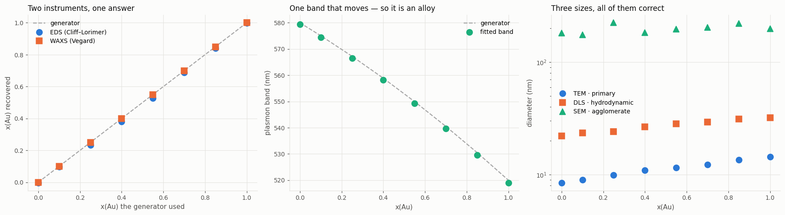

# NanoOrganizer

Organise experimental metadata, visualise any measurement, analyse in batch,
and compare across samples.

A laboratory accumulates data faster than it accumulates structure: a folder of
spectra here, a drive of micrographs there, and the conditions that produced
them in a notebook or a script. NanoOrganizer gives that material one
sample-centric model, so a question like *does the band shift with synthesis
temperature?* is a filter and a plot rather than an afternoon.

**The loop is the point: filter → analyse → new columns → filter again.**

```python
from NanoOrganizer import open_project

wb = open_project("/data/MyProject")
wb.filter("`synthesis.conditions.temperature_C` >= 90")
wb.batch("peak_fit")                     # writes derived columns back
wb.plot_compare("synthesis.conditions.temperature_C", "derived.peak1_center")
```

## Install

```bash
pip install -e ".[web,image]"
```

Dependencies are numpy, scipy, matplotlib and pandas; Pillow and scikit-image
for micrographs, Streamlit and Plotly for the GUI. Nothing else.

## Try it without any data

```bash
python -m NanoOrganizer.demo ~/NanoOrganizerDemo     # the full showcase
python -m NanoOrganizer.demo ~/NanoQuick --quick     # small and fast
```

or from the web app: **Project → No project yet? Generate an example one**.
Nothing is downloaded; both projects are simulated on the spot and can be
deleted freely.

**The showcase** is a Cu–Au alloy nanocatalyst library for CO₂
electroreduction, characterised the way a real campaign would be: fifteen
techniques across four stages, a sparse measurement matrix, and one synthesis
that failed. Everything in it follows from **one hidden number per sample** —
the gold atomic fraction *x* — so techniques that never met can be checked
against each other.


*Every panel above is read straight out of the generated project through the
same loaders the GUI uses. Nothing is drawn specially for the documentation —
`scripts/make_readme_figures.py` is the whole of it.*

Why Cu–Au: the two metals are miscible at every composition, so a composition
series is a real material rather than a thought experiment, and the textbook
consequences arrive together. The lattice parameter follows **Vegard's law**,
so a diffraction peak measures composition. The particles keep **one** plasmon
band that moves from 580 nm to 520 nm — which is how you know an alloy formed
rather than a mixture of copper particles and gold particles, since a mixture
shows two fixed bands whose heights change instead.

### Measurements that never met, brought back together

```python
from NanoOrganizer import open_project
from NanoOrganizer.demo import build_showcase_project, showcase_truth

wb = open_project(build_showcase_project("~/NanoOrganizerDemo"))
wb.batch("peak_fit", modality="waxs1d", x_range=(2.5, 3.6), n_peaks=2,
         background="linear")            # the (111) peak measures composition
showcase_truth()                          # what the generator actually used
```



An electron microscope's X-ray detector and a diffractometer in another room
land on the same composition to within a few percent. The sizes, by contrast, **disagree by an
order of magnitude and all three are right**: TEM resolves primary particles,
DLS reports the hydrated object weighted by the sixth power of diameter, and
SEM at this magnification sees only the agglomerates. The gap between them is
the information, which is the argument for keeping them in one table.

### The payoff: a structure–property chain


DFT gives the d-band centre, which sets how strongly the surface binds CO,
which the IR spectrum sees directly as the C–O stretch, which sets the
selectivity. Bind CO too weakly and it desorbs before anything happens to it;
too strongly and it never leaves. So the CO partial current is a **Sabatier
volcano** in the binding energy — and that is the reason anyone builds a
composition series in the first place.

`notebook/05_multimodal_demo` is the full tour. `notebook/00_quickstart` →
`04_compare` walk the same pipeline on the smaller project, and
[`docs/demo_data.md`](docs/demo_data.md) records what is in the showcase on
purpose — including the failed run, the sparse matrix, and the one technique
with no story to tell.

## The model

```
Project                    a directory of samples, its path aliases, its store
 └── Sample(sample_id)     the thing that persists
      ├── stages           one execution each, with its own provenance
      ├── measurements     one body of data each, referenced not loaded
      └── derived          computed values — filterable beside the authored ones
```

A sample is the unit, not a run: one sample is made once, used several times,
and characterised for weeks by different instruments. Keying on the sample
survives re-measurement; keying on a run scatters it.

Paths are stored **exactly as the instrument recorded them** and mapped per
machine, so a project whose data is not currently mounted still browses — it
reports as unreadable rather than breaking.

## Technique is metadata, not a code path

Visualisation dispatches on what the data *is*:

| group | shapes | techniques shipped |
|---|---|---|
| Curves (1D) | curve, series | UV-Vis, Raman, IR, XPS, XAS, EDS, SAXS/WAXS 1D, XRD, DLS, electrochemistry, DFT DOS |
| Images & Maps (2D) | image, map | TEM, SEM, optical, cell, SAXS/WAXS 2D, GIWAXS |
| Volumes (3D) | volume, stack | tomography, z-stack |
| Correlation | corr, twotime | XPCS g₂, two-time |

Adding a technique is one registry entry and changes no page:

```python
from NanoOrganizer.core.modality import Modality, register

register(Modality(key="pl", label="Photoluminescence", domain="wavelength",
                  shape="series", x_label="Wavelength (nm)",
                  y_label="Intensity (a.u.)", extensions=(".txt", ".csv"),
                  analyses=("peak_fit",), category="spectroscopy"))
```

## The web app

```bash
streamlit run NanoOrganizer/web_app/Home.py      # or: viz
```

Pages sharing one selection — **Project → Structure → Explore & Filter →
Visualize → Analyze → Compare** — plus general-purpose plotting tools. The GUI
drives the same `Workbench` object the notebooks use, so the two cannot drift
apart.

Every drawing tab offers two engines: **static** matplotlib figures to export,
and **interactive** Plotly ones to handle — zoom a shoulder, read a pixel under
the cursor, and turn a tomogram around. Both live in the package, so a notebook
gets them too:

```python
from NanoOrganizer.viz import interactive as iv

iv.volume_figure(volume, mode="volume", level=130,
                 voxel_size=2.0, unit="nm").show()
```


`mode` is `isosurface`, `volume`, `points` or `slices`; the slice planes can be
positioned, and the threshold is a control rather than a constant, because that
one number decides what the structure appears to be. Large volumes are strided
down before rendering and the title says by how much — a browser does not
degrade gracefully on a 128³ translucent volume, it locks the tab.

## Understanding a dataset's layout

Before organising a dataset you have to know its shape. `NanoOrganizer.structure`
walks anything — a directory, a JSON record, an HDF5 group, an `.npz`, a Python
metadata module — one layer at a time, reading **structure, not data**: shapes
come from file headers, so a 4 GB tomogram is described without being opened.

```python
from NanoOrganizer import structure
print(structure.tree("~/NanoOrganizerDemo", depth=1))
```

```
📁 NanoOrganizerDemo  11 folders · 1 file · .txt 1 · 1 hidden
├── 📁 Computation  8 folders
├── 📁 DLSData  8 folders
├── 📁 Dynamics  3 folders
├── 📁 Electrochemistry  8 folders
├── 📁 MetaData  4 files · .py 4 · 1 hidden
├── 📁 RawSpectra  1 folder
├── 📁 Scattering  8 folders
├── 📁 SEMData  8 folders
├── 📁 Spectroscopy  8 folders
├── 📁 TEMData  8 folders
├── 📁 TomoData  2 folders
└── 📄 README.txt  1.2 KB
```

The same walk descends *into* a file, which is the part `ls` cannot do. An
address is a path, optionally followed by `::` and a path inside the file —
`run.h5::entry/instrument`, `record.json::project/samples/0` — and that is what
makes descending into a folder and descending into a file the same operation.

```python
print(structure.tree("~/NanoOrganizerDemo/MetaData/Characterization_dict.py"
                     "::Characterization_dict/CuAu05", depth=2, limit=4))
```

```
🔑 CuAu05
├── · sample_id  str = CuAu05
├── 🔑 characterization_batch  5 keys
│   ├── · run_id  str = char_05
│   ├── · batch_tag  str = library_2
│   ├── · campaign  str = CuAu-CO2RR
│   ├── · status  str = done
│   └── … +1 more  raise the per-layer limit to see them
├── 🔑 UVVis  7 keys
│   ├── · modality  str = uvvis
│   ├── · instrument  str = DemoSpec HR4000
│   ├── · note  str = in-situ growth series; the last frame is the product
│   ├── · n_frames  int = 14
│   └── … +3 more  raise the per-layer limit to see them
├── 🔑 EDS  7 keys
│   ├── · modality  str = eds
│   ├── · instrument  str = DemoSEM + 100 mm2 SDD
│   ├── · beam_energy_keV  float = 20
│   ├── · quantification  str = Cliff-Lorimer
│   └── … +3 more  raise the per-layer limit to see them
└── … +8 more  raise the per-layer limit to see them
```

The **🌳 Structure** page is the same walk with buttons: click a thing, see
what is inside it, click again, with every ancestor one click away in the
breadcrumb. Dot-files and `__pycache__` are hidden by default but *counted* in
the summary, never silently dropped.

## Analyses

Three technique-neutral analyses ship with the package:

| | |
|---|---|
| `peak_fit` | one or more peaks plus a constant or linear background, on any 1D curve |
| `curve_metrics` | height, position, area, centroid and threshold crossing in a window — no model fitted |
| `particle_sizing` | micrographs: Otsu plus watershed, calibrated to nm from the image's own metadata |

`curve_metrics`' threshold crossing is the same operation as *the potential at
10 mA cm⁻²*, *the onset of an absorption edge* and *the lag time at which a
correlation function has half decayed*. Writing it once is the argument for a
modality registry in miniature.

An analysis that applies to several modalities prefixes its derived columns
with the modality it ran on — `derived.uvvis_peak1_center` beside
`derived.waxs1d_peak1_center` — so fitting two techniques cannot silently
overwrite one result with the other.

Chemistry-specific analyses belong in a package of their own and register
themselves on import:

```python
from NanoOrganizer.analysis import Analysis, register_analysis

register_analysis(Analysis(key="my_assay", func=my_assay, label="…",
                           modalities=("uvvis",), stages=("reaction",)))
```

Results carry their own provenance. A fit window, an R² and a point count are
part of a measurement, not decoration — and a batch reports its failures rather
than skipping them.

## Documentation

| | |
|---|---|
| [`docs/sample_model.md`](docs/sample_model.md) | the data model, path aliases, ingest |
| [`docs/analysis.md`](docs/analysis.md) | analyses, the registry, and decisions that affect the numbers |
| [`docs/web_app.md`](docs/web_app.md) | the GUI, and how to extend it |
| [`docs/demo_data.md`](docs/demo_data.md) | the generated example projects, and what is in them on purpose |
| [`docs/archive/`](docs/archive/) | notes from earlier versions, kept for reference |

## Extending it

| to add | do |
|---|---|
| a technique | `register()` a `Modality` |
| an analysis | `register_analysis()` an `Analysis` |
| a metadata format | `register_adapter()` an `Adapter` |
| a filename convention | `register_grammar()` a `FrameGrammar` |

## Tests

```bash
pytest
```

264 tests, including the Streamlit pages driven through `AppTest` against both
generated projects — the small one, and the fifteen-technique showcase that
exercises all four visualisation groups at once. No test needs a data mount.

The figures in this file are part of that: `python
scripts/make_readme_figures.py` rebuilds every one of them from the generator,
so a figure that stops reproducing means the pipeline changed.

## License

MIT — see [LICENSE](LICENSE).
