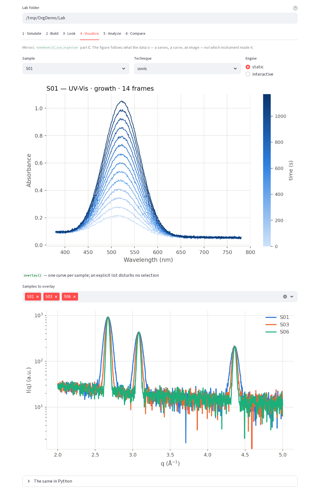
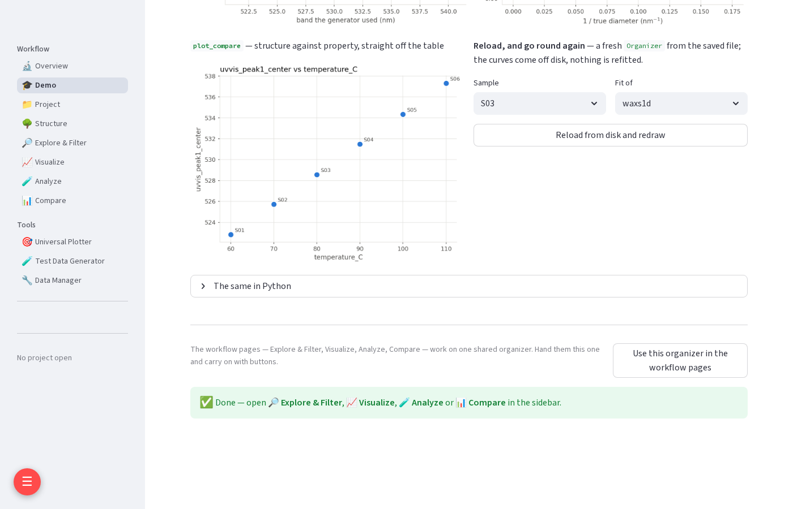
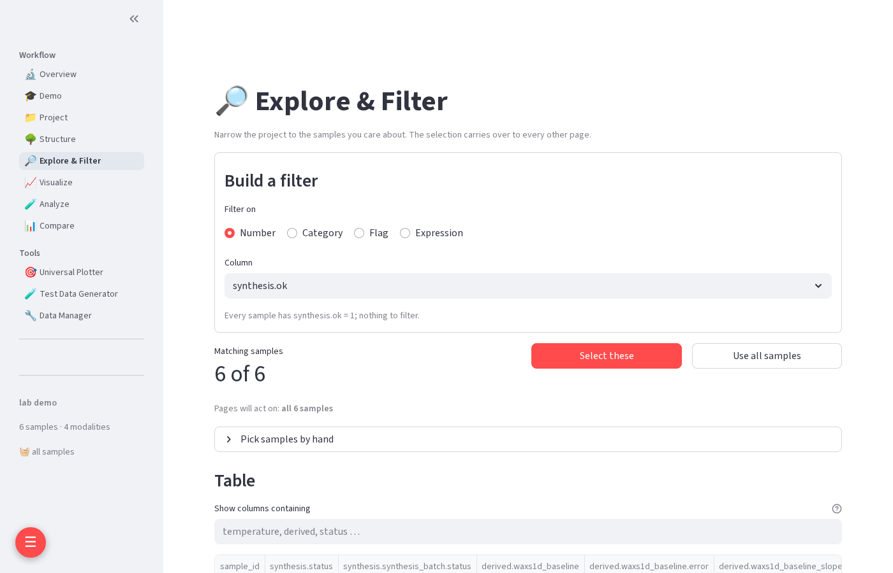
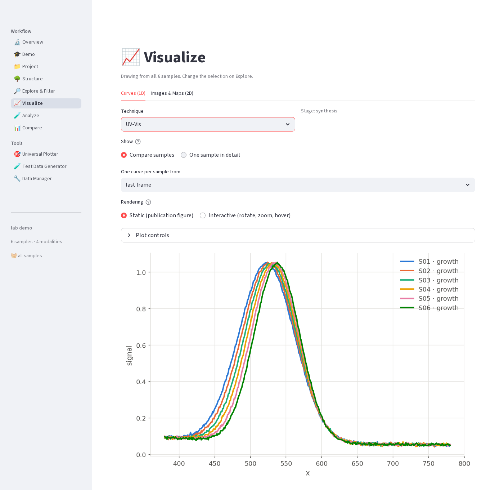
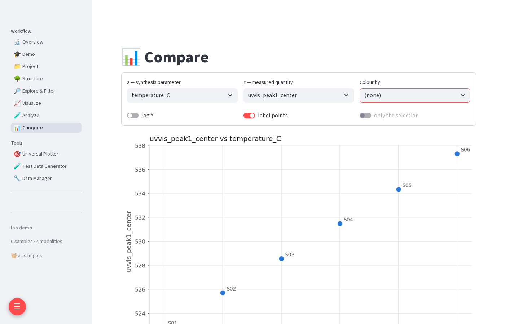

# How the GUI works — a walkthrough with the demo

The web app is the package with buttons on it. It drives the same
`Organizer` object the notebooks use and calls the same functions, so this
walkthrough is also a tour of the Python API: every step below names the call
it makes.

The route is the **🎓 Demo** page, which does what the three workflow notebooks
do — `notebook/10_simulate_data` → `11_build_organizer` → `12_use_organizer` —
in six tabs, then hands the result to the workflow pages.

All screenshots were taken from a fresh run with the demo data written to
`/tmp/OrgDemo`.

---

## 1. Start the app

```bash
pip install -e ".[web,image]"                    # once: Streamlit, Plotly, Pillow, scikit-image
streamlit run NanoOrganizer/web_app/Home.py      # → http://localhost:8501
```

That is the open mode, for your own machine. On a shared machine use the
console command, which adds a password and fences the file browser:

```bash
viz                  # port 8800, asks for a password to set
viz 8900 s3cret      # port and password given
```

Either way the server binds every interface so the app is reachable by
hostname; set `NANOORGANIZER_HOST=127.0.0.1` to keep it local. Demo data goes
under `~/Repos/OrgDemo` — set `NANOORGANIZER_DEMO_ROOT` to put it elsewhere.

The sidebar lists the pages. **Workflow** is the part that matters:

| page | what it is for |
|---|---|
| 🔬 Overview | what the app is, and where to start |
| 🎓 **Demo** | this walkthrough: notebooks 10–12 as six tabs |
| 📁 Project | open or create an organizer, link data, edit parameters, save |
| 🌳 Structure | look inside a folder, a JSON file or an HDF5 file before organising it |
| 🔎 Explore & Filter | filter the sample table; this sets the **selection** every later page uses |
| 📈 Visualize | draw any measurement, chosen by what the data *is* |
| 🧪 Analyze | run an analysis on one sample or the whole selection |
| 📊 Compare | plot a fitted quantity against a synthesis parameter |

Below the page list, the sidebar always shows the open organizer and the
current selection, so a filter set on one page never silently narrows
another.

---

## 2. The Demo page, tab by tab

Open **🎓 Demo**. The **Lab folder** at the top is where everything goes —
`~/Repos/OrgDemo/Lab` by default. Each tab starts with a caption saying which
notebook part it mirrors, and ends with **The same in Python**: the exact
calls it just made, ready to paste into a notebook. A tab whose prerequisite
is missing says which tab to go back to.

### 1 · Simulate — `notebook/10`


**Simulate the lab data** writes what a real rig leaves behind: three
instruments, three folder trees, three naming conventions, none of them laid
out as `<Modality>Data/<SampleID>/`. The operator's metadata dict mentions
**only the spectra**. The micrographs and the diffraction come from other
people on other days, and in the next tab they are linked by hand.

One hidden number per sample, the **synthesis temperature**, sets the
particle size. The size sets the plasmon band, the diffraction line width and
what the micrographs show. The answer key is shown here so tab 6 can check
what the pipeline recovers.

```python
from NanoOrganizer.demo.lab import simulate_lab
lab = simulate_lab("~/Repos/OrgDemo/Lab")
```

Pressing it again rewrites the same files with the same numbers; nothing else
in the folder is touched.

### 2 · Build — `notebook/11`


Four buttons, in order:

| button | call | what you see |
|---|---|---|
| **Create Organizer(lab.json)** | `org = Organizer("…/lab.json", name="lab demo")` | an empty organizer — one JSON file you name |
| **Ingest the metadata dict** | `org.ingest(synthesis=Synthesis_dict)` | six samples with their conditions; the spectra came in with the dict |
| **Link micrographs and diffraction by hand** | `org.link(s, "tem", folder, …)`, `org.link(s, "waxs1d", file, …)` | the catalog fills in: 14 · 3 · 1 files per sample |
| **Save lab.json** | `org.save()` | the file on disk, plus the re-importable links table |

Linking a folder keeps only files that match the technique's extensions, so
the `session.txt` beside each set of micrographs is left out. Paths are
recorded exactly as given, and the data never moves.

If `lab.json` already exists, perhaps written by notebook 11, the first button
becomes **Reopen lab.json** and brings back everything in it. **Start over**
deletes only `lab.json` and its `results/` folder, never the raw data, and asks
for confirmation first.

### 3 · Look — `notebook/12` parts A–B


What the organizer holds, without reading any data:

* `describe()` gives the counts, techniques and readability; `tree()` walks
  the live session one layer at a time.
* `ids(query)` answers a question without changing the selection. Edit the
  query box and the list follows.
* `frames("S01", "uvvis")` lists one row per file, with the time each
  filename gave (`t_s`). `data(..., t=600)` selects the nearest frame by that
  time.
* `data(..., lazy=True)` returns the file list without opening anything; a
  file is read only when you index it.

### 4 · Visualize — `notebook/12` part C



Pick a sample and a technique; the figure follows what the data *is*:

```python
fig, ax = plt.subplots()
org.plot("S01", "uvvis", ax=ax)                      # a series, coloured by time
org.overlay("waxs1d", sample_ids=["S01", "S03", "S06"], ax=ax)
```

The UV-Vis series is coloured along one hue by acquisition time, taken from
the filenames, so a colour bar replaces a legend of fourteen timestamps. Pick
`tem` and the micrograph is drawn on nanometre axes, because the TIFF carried
its pixel size. Switch **Engine** to *interactive* for the same figure in
Plotly: zoom, hover, read values.

### 5 · Analyze — `notebook/12` part D


**The kernel first.** The page takes S01's WAXS arrays and fits them directly:

```python
x, Y, info = org.data("S01", "waxs1d")
fit = fit_peaks(x, Y[0], x_range=(2.3, 3.0), n_peaks=1, background="linear")
plot_fit(fit.x, fit.y, fit.y_fit, fit.residual, ax=ax)
```

The fit and the figure are **two separate calls**: `fit_peaks` computes and
draws nothing, and `plot_fit` draws and computes nothing. Move the window
slider and both run again. Drag the upper edge past 3.0 and the fit starts to
take in the next reflection. The residual stops looking like noise and R²
drops, which is what you want to notice *before* fitting the whole set.

**Then the batch.** **Batch these parameters over every sample** fits the
WAXS peak and the UV-Vis band on all six samples. It writes the fitted values
back as derived columns, links each fit's curves beside `lab.json`, and saves:

```python
org.batch("peak_fit", modality="waxs1d", link=True, **params)
org.batch("peak_fit", modality="uvvis", link=True,
          x_range=(450, 700), n_peaks=1, background="linear")
```

### 6 · Compare — `notebook/12` parts E–F


This tab goes from ids to a table to plots. It joins the fitted values with
the answer key and checks them against it:

* the **plasmon band** is recovered to within about 1.3 nm;
* the **WAXS line width** against 1 / diameter is a straight line through the
  origin. Its slope comes out at 0.561 against the 0.565 the generator used,
  which is Scherrer.

Two techniques that never met recover the same hidden number. The
`plot_compare` panel plots a measured quantity against a synthesis parameter.

**Reload from disk and redraw** opens a *fresh* `Organizer` from the saved
file and draws a stored fit with `plot_peak_fit(result, ax=ax)`. The curves
come off disk; nothing is refitted.

```python
later = Organizer("…/lab.json")
result = later.result("S03", "peak_fit", modality="waxs1d")
plot_peak_fit(result, ax=ax)
```

---

## 3. Carry on in the workflow pages

The demo organizer is the page's own until you hand it over. **Use this
organizer in the workflow pages**, at the bottom of the Demo page, makes it
the one every workflow page works on; the sidebar now names it.



**🔎 Explore & Filter** sets the selection. Filter on a number, a category, a
flag or a pandas expression. **Select these** makes the result the basket
that Visualize, Analyze and Compare act on. The table below has every
parameter and every derived column, including the fits from tab 5.



**📈 Visualize** draws any measurement in the selection. Its tabs are
grouped by what the data is, not by instrument: *Curves (1D)* holds UV-Vis
and WAXS; *Images & Maps (2D)* holds the micrographs. *Compare samples* puts
one curve per sample on a shared axis; *One sample in detail* shows every
frame of one sample. **Plot controls** gives colours, markers, log axes,
limits and figure size, and every figure can be static (matplotlib) or
interactive (Plotly).



**🧪 Analyze** runs any registered analysis on one sample or the selection.
Its option form is generated from the analysis function's signature. A
single run writes nothing; a batch writes derived columns.

**📊 Compare** plots any derived column against any parameter. Colour it by a
category and the page warns when the spread between groups beats the spread
within one, which is a sign that the grouping and the x axis are confounded.



---

## 4. The same file from a notebook

The Demo page saves the same `lab.json` notebook 11 writes, so the two take
turns on it:

```python
from NanoOrganizer import Organizer

org = Organizer("~/Repos/OrgDemo/Lab/lab.json")   # what the page built
org.describe()
org.results()                                     # the fits from tab 5
```

The reverse also works. Run notebooks 10 and 11, then **Reopen lab.json** on
the Demo page, or open it from **📁 Project** by pasting the path to the
`.json` file. Its links, parameters, derived values and stored fits come
back intact.

| to learn | read |
|---|---|
| the pages in depth, and how to extend them | [`web_app.md`](web_app.md) |
| the data model behind the organizer | [`sample_model.md`](sample_model.md) |
| the analyses and the kernel/adapter rule | [`analysis.md`](analysis.md), [`kernel_adapter_rule.md`](kernel_adapter_rule.md) |
| the same walk in code | `notebook/10_simulate_data` → `11_build_organizer` → `12_use_organizer` |
