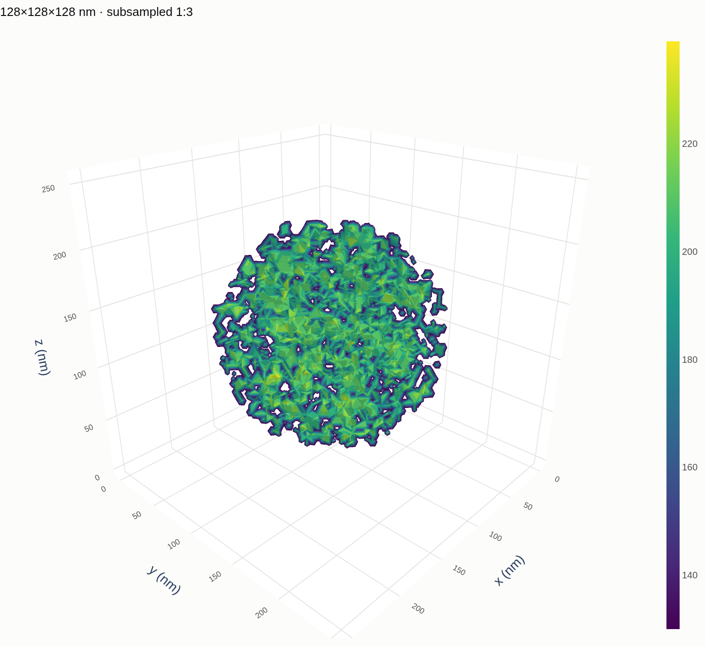

# The web app

```bash
streamlit run NanoOrganizer/web_app/Home.py     # or the `viz` console command
```

The app used to be a flat list of single-technique pages. It is now a
**five-step workflow** plus a tools section, with technique chosen *inside* the
Visualize page from the modality registry — so adding a technique changes no
page.

## The pages

| | |
|---|---|
| **📁 Project** | Open a folder, map recorded paths onto this machine, read the metadata dicts, attach data folders, save — or generate an example project to explore |
| **🌳 Structure** | Drill into a folder, a metadata file or an archive, one layer at a time |
| **🔎 Explore & Filter** | Filter the sample table; this sets the **selection** every later page uses |
| **📈 Visualize** | Draw any measurement, grouped by what the data *is* |
| **🧪 Analyze** | Run an analysis on one sample or the whole selection; results become new, filterable columns |
| **📊 Compare** | Plot a measured quantity against a synthesis parameter |

The loop is the point: **filter → analyse → new columns → filter again.**

Structure sits outside that loop: it is what you open *before* a project
exists, when the question is still "what is in this directory".

## One selection, shared

Every page works on one `Workbench` held in `st.session_state`, so the basket
built on Explore is the basket Analyze and Compare act on. It is shown in the
sidebar on every page with a one-click **Clear** — a filter applied on one page
silently narrowing another page's results is exactly the surprise shared state
causes, so it is never invisible.

It is the same `Workbench` the notebooks use. A page and a notebook cannot
drift apart in behaviour, because there is only one implementation.

## Visualize dispatches on shape, not technique

The tabs are the four visualisation groups from
`NanoOrganizer/core/modality.py`:

| tab | shapes | techniques |
|---|---|---|
| **Curves (1D)** | curve, series | UV-Vis, Raman, IR, XPS, XAS, EDS, SAXS/WAXS 1D, XRD, DLS, electrochemistry, DFT DOS |
| **Images & Maps (2D)** | image, map | TEM, SEM, optical, cell, SAXS/WAXS 2D, GIWAXS |
| **Volumes (3D)** | volume, stack | tomography, z-stack |
| **Correlation** | corr, twotime | XPCS g₂, two-time |

Only the groups present in the current selection are shown. A volume is drawn
as a single plane or as a **slab** projection: projecting the full depth of a
dense sample saturates, because everything is in front of something. Technique and stage
are selectors inside a tab; they change axis captions and defaults, not the code
path. Microscopy modalities additionally get a *Check the particle
segmentation* panel, because a size distribution should never be trusted
without looking at the outlines.

## Two rendering engines

Every drawing tab offers **Static** (matplotlib — the figure you would put in
a paper) and **Interactive** (Plotly — zoom a shoulder, read a pixel under the
cursor, rotate a volume). Volumes default to interactive, because a projection
answers *what is in there* and only rotation answers *what shape is it*;
everything else defaults to static.



*The demo tomogram in `volume` mode. The axes are in nanometres because the
measurement carries its voxel size; the title records the striding.*

The controls themselves live in `web_app/components/plot_controls.py` and
return a frozen settings object, so all four tabs share one vocabulary and a
control added there appears everywhere it applies:

| group | controls |
|---|---|
| curves | colour, marker, line style, width, marker size, opacity, log x/y, manual limits, grid, legend and its position, title and axis labels, figure size |
| images | colormap, log intensity, contrast percentile or manual range, equal aspect, origin, colour bar, draw as a 3D surface |
| volumes | isosurface / translucent volume / point cloud / orthogonal slices, threshold, opacity, shells, detail budget, slice positions — or the flat slice and slab projections |

Two traps worth knowing. Plotly's `Greys` runs white→black and its `RdBu` runs
red→blue — both the opposite way from the matplotlib colormaps of the same
name, so the mapping in `COLORMAPS` reverses them; without that, switching a
TEM micrograph to interactive turns the particles from dark to bright. And
Plotly has no `Bone` scale at all: asking for one raises. `tests/test_interactive.py`
checks every offered name against both.

Volumes are strided down before rendering and the figure title says by how
much. That is not politeness — a browser does not slow down gracefully on a
128³ translucent volume, it locks the tab.

## Structure reads layout, not data

Folders, JSON, HDF5, `.npz` and Python metadata modules all open the same way:
a node, its children, click one, repeat. A breadcrumb keeps every ancestor one
click away, so descending into the wrong branch costs nothing.

Shapes and dtypes come from file headers, so a 4 GB tomogram is described
without being opened, and nothing on the page loads a dataset or plots. An
address is a path optionally followed by `::` and a path inside the file —
`run.h5::entry/instrument` — which is what lets "descend into a folder" and
"descend into a file" be the same operation.

The traversal is `NanoOrganizer.structure`, so the same walk works from a
notebook: `print(structure.tree(path, depth=3))`.

Reading a `.py` metadata module **executes it**. The page says so before it
happens, and the allowed-roots rule applies here exactly as it does to the
folder picker — a structure browser must not become a way around it.

## Analyze builds its own controls

The option form is generated by reading each analysis function's **signature**:
a bool becomes a toggle, a float a number box, a `(lo, hi)` tuple a pair. A
registered analysis therefore gets a working form with no change to the page —
the same principle as the modality registry.

Parameters whose default is `None` sit behind an "override" toggle. For these
analyses `None` means *work it out from the data* (the watershed seed spacing,
the baseline wavelength), and silently replacing that with a number would
change results without anyone asking.

A single run does **not** write to the store by default; a batch does. An
exploratory click should not quietly change the results table.

## Compare checks for a confound

When points are coloured by a grouping column, the page compares the spread of
the y value *between* groups against the spread *within* any one group. If
between beats within, it says the grouping may be confounded with the x axis
and that you should compare within one group first. If every group holds a
single sample it says that instead — the two effects are then arithmetically
inseparable, and no warning dressed up as statistics would help.

It also reports the case where every group holds a single sample, since the
two effects are then arithmetically inseparable and no warning dressed up as
statistics would help.

## Tools

Retained general-purpose utilities, mounted from the old pages folder:
**Universal Plotter**, **Test Data Generator**, **Data Manager**. Each is
optional — a missing file is skipped rather than taking the app down.

## What happened to the old pages

Navigation is declared with `st.navigation`, which **disables `pages/`
auto-discovery**. The older single-purpose pages (CSV Plotter, Image Viewer, Multi-Axes, 3D
Plotter, Data Viewer) remain on disk and can still be run directly:

```bash
streamlit run NanoOrganizer/web_app/pages/2_CSV_Plotter.py
```

They are superseded by Visualize and the Universal Plotter. Re-listing one is a
single line in `sections` in `Home.py`.

## Extending it

- **A new technique** → one `register()` in `core/modality.py`. Visualize picks
  it up; no page changes.
- **A new analysis** → one `register_analysis()` in `analysis/__init__.py`.
  Analyze offers it, builds its form, and batches it.
- **A new authoring format** → one `register_adapter()` in `ingest/__init__.py`.

## Testing

`tests/test_webapp.py` drives the real pages through Streamlit's `AppTest`
against a synthetic project, so it needs no data mount. It clicks through the
interactions that matter rather than only checking that pages render.

`tests/test_webapp_showcase.py` repeats the render checks against the
fifteen-technique demo project. That is the case the generalisation was for —
four visualisation groups, three stages, and a sample with no data at all —
and a two-technique fixture cannot exercise it.

One trap worth knowing: `AppTest.exception` is an **ElementList**, empty rather
than `None` when the page ran cleanly. Assert `not app.exception`; asserting
`app.exception is None` fails on every passing page.
